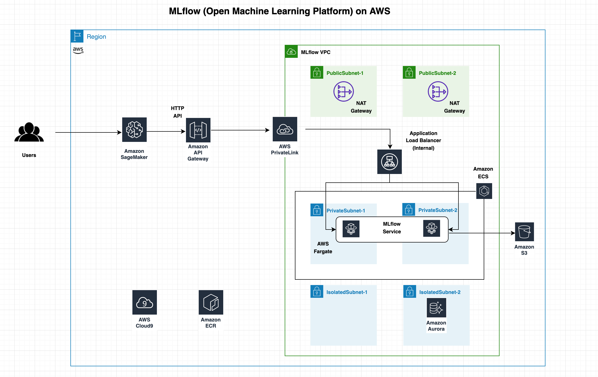
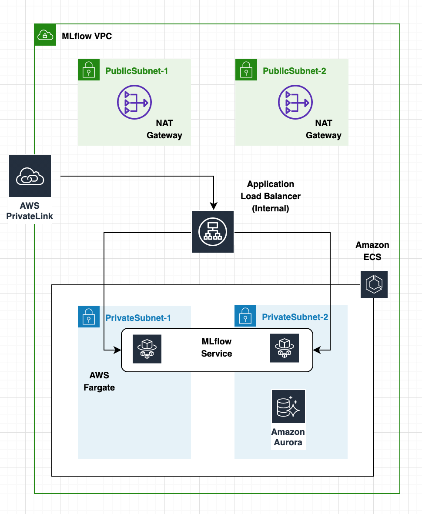
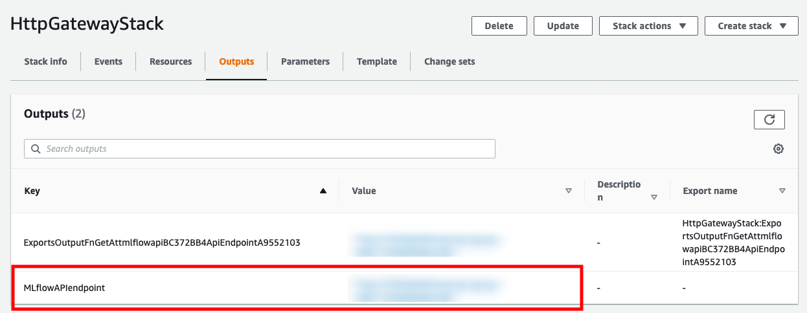
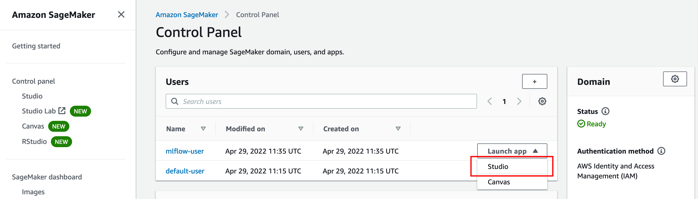
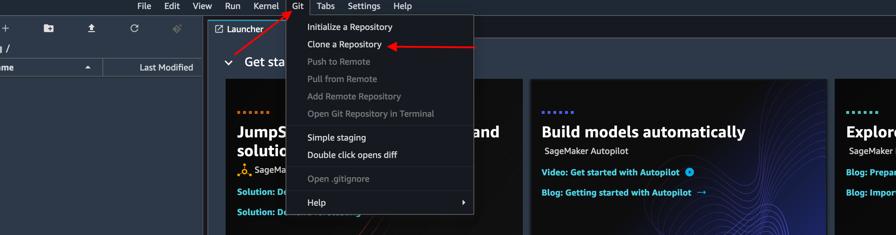

# MLflow (Open Machine Learning Platform) on AWS

[](https://gitpod.io/#https://github.com/aws/aws-cdk)
[](https://badge.fury.io/js/aws-cdk)
[](https://badge.fury.io/py/aws-cdk.core)
[](https://badge.fury.io/nu/Amazon.CDK)

## Introduction

MLflow is an open-source platform to manage the ML lifecycle, including experimentation, reproducibility, deployment, and a central model registry.
[MLflow](https://mlflow.org/) is a framework for end-to-end development and tracking of machine learning projects and a natural companion to [Amazon SageMaker](https://aws.amazon.com/sagemaker/), the AWS fully managed service for data science. MLflow solves the problem of tracking experiments evolution and deploying agnostic and fully reproducible ML scoring solutions. It includes the following components.

* Tracking – Record and query experiments: code, data, configuration, and results
* Projects – Package data science code in a format to reproduce runs on any platform
* Models – Deploy ML models in diverse serving environments

## Architecture

In this project, we show how to deploy MLflow on [AWS Fargate](https://aws.amazon.com/fargate) with basic authentication and use it during your ML project with [Amazon SageMaker](https://aws.amazon.com/sagemaker).
Our solution is based on three main high level components: 
* MLFlow server;
* HTTP API Gateway; and
* SageMaker Studio domain and SageMaker Studio user.

### MLflow Server
MLflow is provisioned in a VPC on an [Amazon ECS](https://aws.amazon.com/ecs/) cluster using AWS Fargate for the serverless compute engine.
The MLflow application is shielded by an internal Application LoadBalancer.
We use [Amazon Simple Storage Service](http://aws.amazon.com/s3) (Amazon S3) and [Amazon Aurora](https://aws.amazon.com/rds/aurora/) as MLflow artifact and backend stores, respectively.
Finally, we provide a simple authentication mechanism leveraging NGINX and its reverse proxy as well as its basic authentication capabilities. 

### Amazon HTTP API Gateway
In order to implement the private integration, we create a AWS PrivateLink to encapsulate connections between MLflow server and the outside world through an [Amazon HTTP API Gateway](https://docs.aws.amazon.com/apigateway/latest/developerguide/http-api.html).

### SageMaker Studio

[Amazon SageMaker Studio](https://aws.amazon.com/sagemaker/studio/) provides a single, web-based visual interface where you can perform all ML development steps.
SageMaker Studio gives you complete access, control, and visibility into each step required to build, train, and deploy models.
You can quickly upload data, create new notebooks, train and tune models, move back and forth between steps to adjust experiments, compare results, and deploy models to production all in one place.
We will use an Amazon SageMaker Studio to experiment with our machine learning sample problem, and to show how you can integrate SageMaker with MLFlow and can handle the user authentication.

## Implementation

Prior to the availability of AWS PrivateLink, services residing in a single Amazon VPC were connected to multiple Amazon VPCs either (1) through public IP addresses using each VPC’s internet gateway or (2) by private IP addresses using VPC peering.

With AWS PrivateLink, service connectivity over Transmission Control Protocol (TCP) can be established from the service provider’s VPC (Producer) to the service consumer’s VPC (Consumer) in a secure and scalable manner.
Tom Adamski has provided an [architecture](https://aws.amazon.com/blogs/networking-and-content-delivery/how-to-securely-publish-internet-applications-at-scale-using-application-load-balancer-and-aws-privatelink/) where he shows one way of using AWS PrivateLink along with ALB and NLBs to publish Internet applications at scale.
Mani Chandrasekaran provided a [solution](https://aws.amazon.com/blogs/compute/access-private-applications-on-aws-fargate-using-amazon-api-gateway-privatelink/) where he uses API Gateway to expose applications running on AWS Fargate using REST APIs, but it uses NLB since ALB is not yet supported by this architecture.

Our solution leverages the existing applications / APIs running in AWS Fargate behind a Private ALB inside a VPC and proposes an architecture to expose these APIs securely through HTTP APIs using Amazon API Gateway and AWS PrivateLink.

The target audience for this workshop are developers and architects who want to architect API based services using the existing applications running inside Amazon VPCs.

## Prerequisites
In order to implement the instructions laid out in this post, you will need the following:
- An [AWS account](https://aws.amazon.com/premiumsupport/knowledge-center/create-and-activate-aws-account/)
- an IAM user with Administrator permissions

## Architecture
As shown in Fig 1, we shall create one AWS CDK application consisting of three AWS CDK stacks **MLflowVpcStack**, **HttpApiGatewayStack**, and a **SageMakerStudioUserStack**.

Inside the `MLflowVpcStack`, we deploy mlflowService using Amazon Fargate within the MLFlowVPC.
An internal load balancer distributes external incoming application traffic to the mlflowService.
In order to implement the private integration we create a VpcLink to encapsulate connections between API Gateway and mlflowService.
Inside the `HttpApiGatewayStack`, we create an HTTP API Gateway that integrates with the mlflowService Amazon Fargate service running inside the `MLflowVpcStack` using the Vpclink and internal load balancer listener.


*Fig 1 - Architecture*

Here are the steps we’ll be following to implement the above architecture:

- Create and configure AWS Cloud9 environment
- Provisioning AWS resources using the AWS CDK
- Testing the Http Api
- Cleanup
- Conclusion


## Create and configure AWS Cloud9 environment
Log into the AWS Management Console and search for Cloud9 service in the search bar.

Click Cloud9 and create an AWS Cloud9 environment region based on Amazon Linux 2.
Create an IAM role for Cloud9 workspace as explained [here](https://www.eksworkshop.com/020_prerequisites/iamrole/).
Attache the IAM role to your workspace as explained [here](https://www.eksworkshop.com/020_prerequisites/ec2instance/).
Turn off the AWS managed temporary credentials of the Cloud9 environment as explained [here](https://www.eksworkshop.com/020_prerequisites/workspaceiam/).

## Provisioning AWS resources using the AWS CDK

### Clone the GitHub repository

Open a new terminal inside AWS Cloud9 IDE and run:
```bash
git clone https://github.com/aws-samples/aws-mlflow-sagemaker-cdk
```

### Setting the region

The default region used by the CDK app is `us-west-2`.
If you are already working in `us-west-2` you can skip this section.
However, you can change the default region by setting up the `AWS_REGION` environment variable.
When working on Cloud9, you can specify the same region where your Cloud9 environment is running as follow:

```bash
sudo yum install jq -y
export AWS_REGION=$(curl -s 169.254.169.254/latest/dynamic/instance-identity/document | jq -r '.region')
echo "export AWS_REGION=${AWS_REGION}" | tee -a ~/.bash_profile
export AWS_ACCOUNT=$(aws sts get-caller-identity --query Account --output text)
echo "export AWS_ACCOUNT=${AWS_ACCOUNT}" | tee -a ~/.bash_profile
```

The CDK script expects to find the ENV variable `DOMAIN_ID` in order to figure out if a new SageMaker Studio domain is needed or not.
```bash
export DOMAIN_ID=$(aws sagemaker list-domains | jq -r 'select(.Domains[0] != null) .Domains[0].DomainId | tostring')
echo "export DOMAIN_ID=${DOMAIN_ID}" | tee -a ~/.bash_profile
```

### Resizing the Cloud9
Before deploying, since we use CDK construct to build the container images locally, we need a larger disk size than the one provided by Cloud9 in its default environment configuration (i.e. 20GB, whivh is not enough).
To resize it on the fly without rebooting the instance, you can run the following script specifying a new desired size.

```
cd ~/environment/aws-mlflow-sagemaker-cdk/
./resize-cloud9.sh 100
```
Where `100` represents the new desired disk size in GB.

### Install and bootstrap AWS CDK

The AWS Cloud Development Kit (AWS CDK) is an open-source software development framework to model and provision your cloud application resources using familiar programming languages.
If you would like to familiarize yourself the [CDKWorkshop](https://cdkworkshop.com/) is a great place to start.

Using Cloud9 environment, open a new Terminal and use the following commands:
```bash
cd ~/environment/aws-mlflow-sagemaker-cdk/cdk/nginxAuthentication
npm install -g aws-cdk@2.8.0 --force
cdk --version
```

Take a note of the latest version that you install, at the time of writing this post it is `2.8.0`.
Open the package.json file and replace the version “2.8.0” of the following modules with the latest version that you have installed above.

```typescript
"aws-cdk-lib": "2.8.0",
"@aws-cdk/aws-apigatewayv2-alpha": "2.8.0-alpha.0",
"@aws-cdk/aws-apigatewayv2-integrations-alpha": "2.8.0-alpha.0",
```

This will install all the latest CDK modules under the `node_modules` directory (`npm install`) and prepare your AWS account to deploy resources with CDK (`cdk bootstrap`).

```bash
npm install
cdk bootstrap
```

### Creating AWS resources using the CDK

We shall implement this architecture using an AWS CDK application comprising of two individual CDK stacks:

- **MLflowVpcStack** deploys the MLflow server on Fargate on a Vpc.
- **HttpGatewayStack** deploys the HTTP Api integrated with Fargate service using a Vpclink.

Let us discuss these stacks one by one.

### **MLflowVpcStack**


*Fig 2 - MLFlow VPC*

Under the `./cdk/nginxAuthentication/lib` folder, open the `mlflow-vpclink-stack.ts` file and let us explore the following different CDK constructs.

```typescript
// Export Vpc, ALB Listener, and Mlflow secret ARN
public readonly httpApiListener: elbv2.ApplicationListener;
public readonly mlflowSecretArn: string;
public readonly vpc: ec2.Vpc;
 ```

These three variables enable us to export the provisioned Vpc along with the ALB Listener from **MLflowVpcStack** stack so as to use these to create the Http Api in the **HttpGatewayStack** stack.

**VPC:**

This code creates a MLFlowVPC with public, private, and isolted subnets across 2 availability zones.
The public subnets are used to run the NAT gateway which allows our components in the private subnets to get internet connectivity.
The application code and the database run in the private subnets and isolated subnets respectively.

```typescript
// VPC
const vpc = new ec2.Vpc(this, 'MLFlowVPC', {
  cidr: cidr,
  natGateways: 1,
  maxAzs: 2,
  subnetConfiguration: [
    {
      name: 'public',
      subnetType: ec2.SubnetType.PUBLIC,
      cidrMask: 24,
    },
    {
      name: 'private',
      subnetType: ec2.SubnetType.PRIVATE,
      cidrMask: 26,
    },
    {
      name: 'isolated',
      subnetType: ec2.SubnetType.ISOLATED,
      cidrMask: 28,
    },
  ],
});
```

**AWS Secrets Manager**
We need to generate two kind of credentials, i.e., one for the database backend, and one for the application server.
[AWS Secrets Manager](https://aws.amazon.com/secrets-manager/) helps generate and store secrets securely.
Furthermore, it allows users and applications retrieve secrets with a call to AWS Secrets Manager APIs, eliminating the need to hardcode sensitive information in plain text.

```typescript
// DB Credentials
const databaseCredentialsSecret = new secretsmanager.Secret(this, 'DBCredentialsSecret', {
  secretName: `${serviceName}-credentials`,
  generateSecretString: {
    secretStringTemplate: JSON.stringify({
      username: dbUsername,
    }),
    excludePunctuation: true,
    includeSpace: false,
    generateStringKey: 'password'
  }
});

// Mflow credentials
const mlflowCredentialsSecret = new secretsmanager.Secret(this, 'MlflowCredentialsSecret', {
  secretName: mlflowSecretName,
  generateSecretString: {
    secretStringTemplate: JSON.stringify({
      username: mlflowUsername,
    }),
    excludePunctuation: true,
    includeSpace: false,
    generateStringKey: 'password'
  }
});
```

**Aurora RDS Cluster:**

This creates an Aurora RDS cluster inside the MLFlowVPC.
This database is used by MLflow to store metadata about the ML model generated in our experiments.

```typescript
const dbConfig = {
  dbClusterIdentifier: `${serviceName}-cluster`,
  engineMode: 'serverless',
  engine: 'aurora-mysql',
  engineVersion: '5.7.12',
  databaseName: dbName,
  masterUsername: databaseCredentialsSecret.secretValueFromJson('username').toString(),
  masterUserPassword: databaseCredentialsSecret.secretValueFromJson('password').toString(),
  dbSubnetGroupName: dbSubnetGroup.dbSubnetGroupName,
  scalingConfiguration: {
    autoPause: true,
    maxCapacity: 2,
    minCapacity: 2,
    secondsUntilAutoPause: 3600,
  },
  vpcSecurityGroupIds: [
    dbClusterSecurityGroup.securityGroupId
  ]
};

// RDS Cluster 
const rdsCluster = new CfnDBCluster(this, 'DBCluster', dbConfig);
rdsCluster.addDependsOn(dbSubnetGroup)
```

**ECS Cluster:**

This creates an Amazon ECS cluster inside the MLFlowVPC, we shall be running mlflow service inside this ECS cluster using AWS Fargate.

```typescript
const cluster = new ecs.Cluster(this, "Fargate Cluster" , {
  vpc : vpc,
});
```

**Cloud Map Namespace:**

AWS Cloud Map allows us to register any application resources, such as microservices, and other cloud resources, with custom names. Using AWS Cloud Map, we can define custom names for our application microservice, and it maintains the updated location of the dynamically changing microservice.

```typescript
const dnsNamespace = new servicediscovery.PrivateDnsNamespace(this,"DnsNamespace",{
    name: "http-api.local",
    vpc: vpc,
    description: "Private DnsNamespace for Microservices",
  }
);
```
**ECS Task Role:**

We define in an IAM Role the set of permissions that our AWS Faregat Task is allowed to be granted.
Please also note the inline policy that grants access to the database and mlflow credentials.

```typescript
const taskrole = new iam.Role(this, "ecsTaskExecutionRole", {
  assumedBy: new iam.ServicePrincipal("ecs-tasks.amazonaws.com"),
  managedPolicies: [
    iam.ManagedPolicy.fromAwsManagedPolicyName("service-role/AmazonECSTaskExecutionRolePolicy"),
    iam.ManagedPolicy.fromAwsManagedPolicyName("AmazonS3FullAccess") // for a production environment, you might want to restrict this policy to only the bucket you need.
  ],
  inlinePolicies: {
    secretsManagerRestricted: new iam.PolicyDocument({
      statements: [
        new iam.PolicyStatement({
          effect: iam.Effect.ALLOW,
          resources: [
            mlflowCredentialsSecret.secretArn,
            databaseCredentialsSecret.secretArn
          ],
          actions: [
            "secretsmanager:GetResourcePolicy",
            "secretsmanager:GetSecretValue",
            "secretsmanager:DescribeSecret",
            "secretsmanager:ListSecretVersionIds"
          ]
        }),
        new iam.PolicyStatement({
          effect: iam.Effect.ALLOW,
          resources: ["*"],
          actions: ["secretsmanager:ListSecrets"]
        }),
      ]
    })
  }
});
```

**Task Definition:**

A task definition is required to run Docker containers in Amazon ECS, we shall create the task definition (mlflowTaskDefinition) for the mlflow service.

```typescript
const mlflowTaskDefinition = new ecs.FargateTaskDefinition(
  this,
  "mlflowTaskDef",
  {
    taskRole: taskrole,
    family: "mlFlowStack"
  },
);
```
**Log Groups:**

Let us create a log group mlflowServiceLogGroup and the associated log driver.

```typescript
const mlflowServiceLogGroup = new logs.LogGroup(this, "mlflowServiceLogGroup", {
  logGroupName: "/ecs/mlflowService",
  removalPolicy: cdk.RemovalPolicy.DESTROY,
});

const mlflowServiceLogDriver = new ecs.AwsLogDriver({
  logGroup: mlflowServiceLogGroup,
  streamPrefix: "mlflowService",
});
```
**Task Containers:**

Let us define two containers in the `mlflowTaskDefinition` task definition, i.e. the NGINX container responsible to authenticate requests and acting as reverse proxy, and the MLFlow container where the MLFlow server application code is running.
It is important to note how we securely pass credentials (generated and stored securely in AWS Secrets Manager) to the task definition.
The ECS Task Role described earlier defines, among the others, the custom policy that grants to the Fargate task read-access to exclusively the two secrets needed by the containers.
In this way, all credentials are transparently handled by Fargate, avoiding to expose any sensitive information to the task definition in clear text.

For the interested reader on the topic on how to secure credentials with Fargate and AWS Secrets Manager, [this blogpost](https://aws.amazon.com/blogs/compute/securing-credentials-using-aws-secrets-manager-with-aws-fargate/) provide a more in depth discussion.

```typescript
const nginxContainer = mlflowTaskDefinition.addContainer(
  "nginxContainer",
  {
    containerName: "nginxContainer",
    essential: true,
    // memoryReservationMiB: 512,
    // cpu: 512,
    portMappings: [{
      containerPort: 80,
      protocol: ecs.Protocol.TCP
    }],
    image: ecs.ContainerImage.fromAsset('../../src/nginx', {}),
    secrets: {
      MLFLOW_USERNAME: ecs.Secret.fromSecretsManager(mlflowCredentialsSecret, 'username'),
      MLFLOW_PASSWORD: ecs.Secret.fromSecretsManager(mlflowCredentialsSecret, 'password')
    },
    logging: mlflowServiceLogDriver,
  }
);

const mlflowServiceContainer = mlflowTaskDefinition.addContainer(
  "mlflowContainer",
  {
    containerName: "mlflowContainer",
    essential: true,
    // memoryReservationMiB: 512,
    // cpu: 512,
    portMappings: [{
      containerPort: containerPort,
      protocol: ecs.Protocol.TCP,
    }],
    image: ecs.ContainerImage.fromAsset('../../src/mlflow', {}),
    environment: {
      'BUCKET': `s3://${mlFlowBucket.bucketName}`,
      'HOST': rdsCluster.attrEndpointAddress,
      'PORT': `${dbPort}`,
      'DATABASE': dbName
    },
    secrets: {
      USERNAME: ecs.Secret.fromSecretsManager(databaseCredentialsSecret, 'username'),
      PASSWORD: ecs.Secret.fromSecretsManager(databaseCredentialsSecret, 'password')
    },
    logging: mlflowServiceLogDriver,
  });
```

***NGINX container:***

The NGINX container acts as reverse proxy in front of the MLFlow container, providing also a simple and straighforward way to add Basic Auth to the MLFlow server.

In order to securely inject the credentials auto-generated in AWS Secrets Manager into the container, the credential file for NGINX at container startup.
The creation of the credential file for NGINX is handled by a script whose content is provided below:

```bash
#!/bin/sh
echo -n $MLFLOW_USERNAME: >> /etc/nginx/.htpasswd
openssl passwd -1 $MLFLOW_PASSWORD >> /etc/nginx/.htpasswd
```

In the `Dockerfile`, since we are using the `CMD` command to run the script at startup time, we must include `-g 'daemon off';` in order to allow nginx to stay in the foreground.
As such, Docker can track the process properly (otherwise your container will stop immediately after starting).
Generating the credential file at container startup rather then during the build process adds little overhead, however this is for the greater good, since we have now the security and the flexibility to change credentials too without the need to rebuild the container.

```dockerfile
FROM nginx:1.17.6
RUN apt-get update
RUN apt-get install openssl -y
# Remove default Nginx config
RUN rm /etc/nginx/nginx.conf
# Copy the modified Nginx conf
COPY nginx.conf /etc/nginx/nginx.conf
RUN ln -sf /dev/stdout /var/log/nginx/access.log \
    && ln -sf /dev/stderr /var/log/nginx/error.log

COPY script.sh /root/script.sh
RUN chmod +x /root/script.sh

CMD /root/script.sh && nginx -g 'daemon off;'
```

Finally, let us highlight at an important setting in the `nginx.conf` file, i.e., `resolver 169.254.169.253;`, needed to allow the DNS resolution within the AWS VPC.
In this way, the NGINX container can resolve the MLFlow container IP address via DNS.

```
location / {
  proxy_set_header X-Forwarded-For $proxy_add_x_forwarded_for;
  proxy_set_header Host $http_host;
  proxy_redirect off;
  resolver 169.254.169.253;
  set $mlflow mlflowservice.http-api.local;
  proxy_pass http://$mlflow:5000;
  auth_basic           "Administrator’s Area";
  auth_basic_user_file /etc/nginx/.htpasswd; 
}
```
***MLFlow container:***

The MLFlow container pip-install the MLFlow server.
Then the MLFlow server is started at container startup.
Similarly as we did for the NGINX credentials, we ensure that the credentials for the Aurora Database are injected at startup time by Fargate from the AWS Secrets Manager.

```dockerfile
FROM python:3.8.0

RUN pip install \
    mlflow==1.18.0 \
    pymysql==1.0.2 \
    boto3 && \
    mkdir /mlflow/

EXPOSE 5000

CMD mlflow server \
    --host 0.0.0.0 \
    --port 5000 \
    --default-artifact-root ${BUCKET} \
    --backend-store-uri mysql+pymysql://${USERNAME}:${PASSWORD}@${HOST}:${PORT}/${DATABASE}
```

**Security Groups:**

In order to control the inbound and outbound traffic to Fargate tasks, we shall create a security group that act as a virtual firewall.    

```typescript
const mlflowServiceSecGrp = new ec2.SecurityGroup(
  this,
  "mlflowServiceSecurityGroup",
  {
    allowAllOutbound: true,
    securityGroupName: "mlflowServiceSecurityGroup",
    vpc: vpc,
  }
);
mlflowServiceSecGrp.connections.allowFromAnyIpv4(ec2.Port.tcp(containerPort));
mlflowServiceSecGrp.connections.allowFromAnyIpv4(ec2.Port.tcp(80));
```

**Fargate Service:**

Let us create an ECS Fargate service (mlflowService) based on the task definition created above.
An Amazon ECS service enables you to run and maintain a specified number of instances of a task definition simultaneously in an Amazon ECS cluster. If any of your tasks should fail or stop for any reason, the Amazon ECS service scheduler launches another instance of your task definition to replace it in order to maintain the desired number of tasks in the service. 

```typescript
const mlflowService = new ecs.FargateService(this, "mlflowService", {
  cluster: cluster,
  serviceName: serviceName,
  taskDefinition: mlflowTaskDefinition,
  assignPublicIp: false,
  desiredCount: 2,
  securityGroup: mlflowServiceSecGrp,
  cloudMapOptions: {
    name: "mlflowService",
    cloudMapNamespace: dnsNamespace,
  },
});
```

**ALB:**

The load balancer distributes incoming application traffic across ECS services, in multiple Availability Zones. This increases the availability of your application. Let us add an internal Application Load Balancer.

```typescript
const httpApiInternalALB = new elbv2.ApplicationLoadBalancer(
  this,
  "httpapiInternalALB",
  {
    vpc: vpc,
    internetFacing: false,
  }
);
 ```   
**ALB Listener:**

An ALB listener checks for connection requests from clients, using the protocol and port that we configure.

```typescript
this.httpApiListener = httpApiInternalALB.addListener("httpapiListener", {
  port: 80,
  protocol: ApplicationProtocol.HTTP,
});
```

**Target Groups:**

We shall create a target group, i.e., `mlflowServiceTargetGroup`, pointing to the NGINX container.

```typescript
const mlflowServiceTargetGroup = this.httpApiListener.addTargets(
  "mlflowServiceTargetGroup",
  {
    healthCheck: {
      path: "/elb-status"
    },
    targets: [
      mlflowService.loadBalancerTarget(
        {
          containerName: 'nginxContainer',
          containerPort: 80
        }
      )
    ],
    port: 80,
    protocol: ApplicationProtocol.HTTP,
  }
);
```
**Auto Scaling Group:**

We shall create an auto scaling group for the MLflow server application code.

```typescript
// Task Auto Scaling
const autoScaling = mlflowService.autoScaleTaskCount({ maxCapacity: 6 });
autoScaling.scaleOnCpuUtilization('CpuScaling', {
  targetUtilizationPercent: 70,
  scaleInCooldown: cdk.Duration.seconds(60),
  scaleOutCooldown: cdk.Duration.seconds(60),
});
```

### **HttpApiStack**

Under the `./cdk/nginxAuthentication/lib` folder, open the `http-gateway-stack.ts` file and let us explore the following different CDK constructs.


**VPC Link:**

It is easy to expose our HTTP/HTTPS resources behind an Amazon VPC for access by clients outside of the Producer VPC using API Gateway private integration.
To extend access to our private VPC resources beyond the VPC boundaries, we can create an HTTP API with private integration for open access or controlled access.
The private integration uses an API Gateway resource of VpcLink to encapsulate connections between API Gateway and targeted VPC resources.
As an owner of a VPC resource, we are responsible for creating an Application Load Balancer in our Producer VPC and adding a VPC resource as a target of an Application Load Balancer's listener.
As an HTTP API developer, to set up an HTTP API with the private integration, we are responsible for creating a VpcLink targeting the specified Application Load Balancer and then treating the VpcLink as an effective integration endpoint.
Let us create a Vpclink based on the private subnets of the MLFlowVPC.

```typescript
this.httpVpcLink = new cdk.CfnResource(this, "HttpVpcLink", {
  type: "AWS::ApiGatewayV2::VpcLink",
  properties: {
    Name: "http-api-vpclink",
    SubnetIds: vpc.privateSubnets.map((m) => m.subnetId),
  },
});
```

**API Integration:**

The following construct will integrate the Amazon HTTP API Gateway with the backend mlflowService using the Vpclink and the Application Loadbalancer Listener.

```typescript
// HTTP Integration with VpcLink
const mlflowIntegration = new HttpAlbIntegration(
  'MLflowIntegration',
  httpApiListener,
  { vpcLink: MLflowVpclink }
)
```

**HTTP Api:**

Let us create an Http Api based on a default stage with the an HTTP integration on the VpcLink

```typescript
// HTTP Api
this.api = new apig.HttpApi(this, "mlflow-api", {
  createDefaultStage: true,
  defaultIntegration: mlflowIntegration
});
```

**API Route:**

Now let us create the Http Api proxy routes targeting the Api integration.

```typescript
// HTTP Api Route
this.api.addRoutes({
  integration: mlflowIntegration,
  path: "/{proxy+}"
})
```

After the **MLflowVpcStack** and the **HttpApiGatewayStack** are deployed, the MLflow server is finally accessible.

## *Integration with SageMaker*

We provide two ways to explore the integration between SageMaker and MLFlow.
Each option is encapsulated into its own CDK construct and you are free to pick the option you prefer.

1. **SageMakerStudioUserStack** - deploys a SageMaker Studio (preferred as you can leverage the Studio UI for SageMaker Experiments)
2. **SageMakerNotebookInstanceStack** - deploys a SageMaker Notebook instance 

Let us explore both options and you can then decide which option best suits your needs.

### **SageMakerStudioUserStack (option 1)**

Under the `./cdk/nginxAuthentication/lib` folder, open the `sagemaker-studio-user-stack.ts` file and let us explore the following CDK construct.

**SageMaker execution role**

As a managed service, Amazon SageMaker performs operations on your behalf on the AWS hardware that is managed by SageMaker.
SageMaker can perform only operations that the user permits.
You can grant these permissions via specifying an execution role.
Our use case dictates that not only we need access to the full Amazon SageMaker functionalities, but also to specific S3 buckets (e.g., to store and retrieve training and test data), as well as to the MLFlow credentials stored in AWS Secrets Manager.

```typescript
// SageMaker Execution Role
const sagemakerExecutionRole = new iam.Role(this, "sagemaker-execution-role", {
  assumedBy: new iam.ServicePrincipal("sagemaker.amazonaws.com"),
  managedPolicies: [
    iam.ManagedPolicy.fromAwsManagedPolicyName("AmazonSageMakerFullAccess")
  ],
  inlinePolicies: {
    retrieveApiGatewayUrl: new iam.PolicyDocument({
      statements: [
        new iam.PolicyStatement({
          effect: iam.Effect.ALLOW,
          resources: [`arn:*:cloudformation:${this.region}:${this.account}:stack/${httpGatewayStackName}/*`],
          actions: ["cloudformation:DescribeStacks"],
        })
      ],
    }),
    s3Buckets: new iam.PolicyDocument({
      statements: [
        new iam.PolicyStatement({
          effect: iam.Effect.ALLOW,
          resources: ["arn:aws:s3:::*mlflow*"],
          actions: ["s3:ListBucket","s3:GetObject", "s3:PutObject", "s3:DeleteObject", "s3:PutObjectTagging", "s3:CreateBucket"],
        })
      ],
    }),
    secretsManagerRestricted: new iam.PolicyDocument({
      statements: [
        new iam.PolicyStatement({
          effect: iam.Effect.ALLOW,
          resources: [mlflowSecretArn],
          actions: [
            "secretsmanager:GetResourcePolicy",
            "secretsmanager:GetSecretValue",
            "secretsmanager:DescribeSecret",
            "secretsmanager:ListSecretVersionIds"
          ]
        }),
        new iam.PolicyStatement({
          effect: iam.Effect.ALLOW,
          resources: ["*"],
          actions: ["secretsmanager:ListSecrets"]
        })
      ]
    })
  },
});
```

In the **SageMakerStudioUserStack** we have included logic to either deploy a new SageMaker Studio domain, or to update an existing one.
The CDK script expects to find the ENV variable `DOMAIN_ID` in order to figure out if a new domain is needed or not, which we have setup earlier.

#### Provision a new SageMaker Studio domain
( Skip to [Update an existing SageMaker Studio](#update-an-existing-sagemaker-studio-domain) if you have already an existing SageMaker Studio domain)

Provisioning a new SageMaker Studio domain will do the following operations:

1. Create a SageMaker execution role with the correct permissions

```typescript
// SageMaker Execution Role
const sagemakerExecutionRole = new iam.Role(this, "sagemaker-execution-role", {
  assumedBy: new iam.ServicePrincipal("sagemaker.amazonaws.com"),
  managedPolicies: [
    iam.ManagedPolicy.fromAwsManagedPolicyName("AmazonSageMakerFullAccess")
  ],
  inlinePolicies: {
    retrieveApiGatewayUrl: new iam.PolicyDocument({
      statements: [
        new iam.PolicyStatement({
          effect: iam.Effect.ALLOW,
          resources: [`arn:*:cloudformation:${this.region}:${this.account}:stack/${httpGatewayStackName}/*`],
          actions: ["cloudformation:DescribeStacks"],
        })
      ],
    }),
    s3Buckets: new iam.PolicyDocument({
      statements: [
        new iam.PolicyStatement({
          effect: iam.Effect.ALLOW,
          resources: ["arn:aws:s3:::*mlflow*"],
          actions: ["s3:ListBucket","s3:GetObject", "s3:PutObject", "s3:DeleteObject", "s3:PutObjectTagging", "s3:CreateBucket"],
        })
      ],
    }),
    secretsManagerRestricted: new iam.PolicyDocument({
      statements: [
        new iam.PolicyStatement({
          effect: iam.Effect.ALLOW,
          resources: [mlflowSecretArn],
          actions: [
            "secretsmanager:GetResourcePolicy",
            "secretsmanager:GetSecretValue",
            "secretsmanager:DescribeSecret",
            "secretsmanager:ListSecretVersionIds"
          ]
        }),
        new iam.PolicyStatement({
          effect: iam.Effect.ALLOW,
          resources: ["*"],
          actions: ["secretsmanager:ListSecrets"]
        })
      ]
    })
  },
});
```

2. Create a new SageMaker Studio domain in the default VPC.

```typescript
// SageMaker Studio domain
const defaultVpc = ec2.Vpc.fromLookup(this, 'DefaultVPC', { isDefault: true });
const subnetIds: string[] = [];

defaultVpc.publicSubnets.forEach((subnet, index) => {
  subnetIds.push(subnet.subnetId);
});

const cfnStudioDomain = new sagemaker.CfnDomain(this, 'MyStudioDomain', {
  authMode: 'IAM',
  defaultUserSettings: {
    executionRole: sagemakerExecutionRole.roleArn,
  },
  domainName: 'StudioDomainName',
  vpcId: defaultVpc.vpcId,
  subnetIds: subnetIds,
});
```

3. Create a new SageMaker Studio user attached to the domain and with the execution role previously created attached to it

```typescript
// SageMaker Studio user
const cfnUserProfile = new sagemaker.CfnUserProfile(this, 'MyCfnUserProfile', {
  domainId: cfnStudioDomain.attrDomainId,
  userProfileName: 'mlflow-user',
  userSettings: {
    executionRole: sagemakerExecutionRole.roleArn,
    }
  }
);
```

#### Update an existing SageMaker Studio Domain

Updating an existing SageMaker Studio domain will do the following operations:

1. Create a sagemaker execution role with the correct permissions
2. Create a new SageMaker Studio user attached to the domain and with the execution role previously created attached to it

## Provisioning AWS resources using the AWS CDK

We are finally ready to deploy the full solution

```bash
cd ~/environment/aws-mlflow-sagemaker-cdk/cdk/nginxAuthentication
npm install
cdk bootstrap
```

Finally, we are ready to deploy our stack.
```bash
./deploy.sh
```

## Push the `mlflow-pyfunc` container to ECR

In order to deploy to SageMaker an mlflow model, you need to create a serving container that implements what the SageMaker runtime expects to find.
MLFlow makes this effor easier by providing a CLI command that build the image locally and pushes to your ECR the image.

```bash
# install the libraries
pip install mlflow==1.23.1 boto3

# build and push the container to ECR
mlflow sagemaker build-and-push-container
```

## Testing the Http Api 

### Accessing the MLFlow UI
In order to access the MLFlow UI, we need the URL of the Amazon HTTP API Gateway and the credentials generated for the user authentication.

The HTTP API Gateway can be retrieved from the **HttpApiGatewayStack** CloudFormation output as shown in the figure below.


*Fig 3 - Retrieve Amazon HTTP API Gateway URL*

The MLFlow credentials can be retrieved either by navigating in the console to the AWS Secrets Manager, or by using the aws cli.
```bash
# username
aws secretsmanager get-secret-value --secret-id mlflow-server-credentials | jq -r '.SecretString' | jq -r '.username'
# password
aws secretsmanager get-secret-value --secret-id mlflow-server-credentials | jq -r '.SecretString' | jq -r '.password'
```
### MLFlow / Amazon SageMaker Studio integration lab

In the AWS console, navigate to Amazon SageMaker Studio and open Studio for the `mlflow-user` user as shown in the pictures below.


*Fig 4 - Navigate to Amazon SageMaker Studio*


*Fig 5 - Launch Amazon SageMaker Studio for the `mlflow-user`*

Clone this repository either from the terminal or from the Studio UI.


*Fig 6 - Clone repo in SageMaker Studio*

Navigate to the `./aws-mlflow-sagemaker-cdk/lab/nginxBasicAuth` folder and open the open the `sagemaker_studio_and_mlflow.ipynb` notebook.
You can see how to train in Amazon SageMaker and store the resulting models in MLFlow after retrieving the credentials at runtime and how to deploy models stored in Amazon SageMaker endpoints using the MLFlow SDK.
Furthermore, the lab shows how you can enrich MLFlow metadata with SageMaker metadata, and vice versa, by storing MFlow specifics in SageMaker via SageMaker Experiments SDK and visualize them in the SageMaker Studio UI.

## Cleanup

Before removing all resources created, you need to make sure that all Apps are deleted from the `mlflow-user` user, i.e. all `KernelGateway` apps, as well as the default `JupiterServer`

Once done, you can destroy the CDK stack by running

```bash
cd ~/environment/aws-mlflow-sagemaker-cdk/cdk/nginxAuthentication
./destroy.sh
```

At the prompt, enter `y`.

## Conclusion

The benefit of this serverless architecture is that it takes away the overhead of having to manage underlying servers and helps reduce costs, as you only pay for the time in which your code executes.

