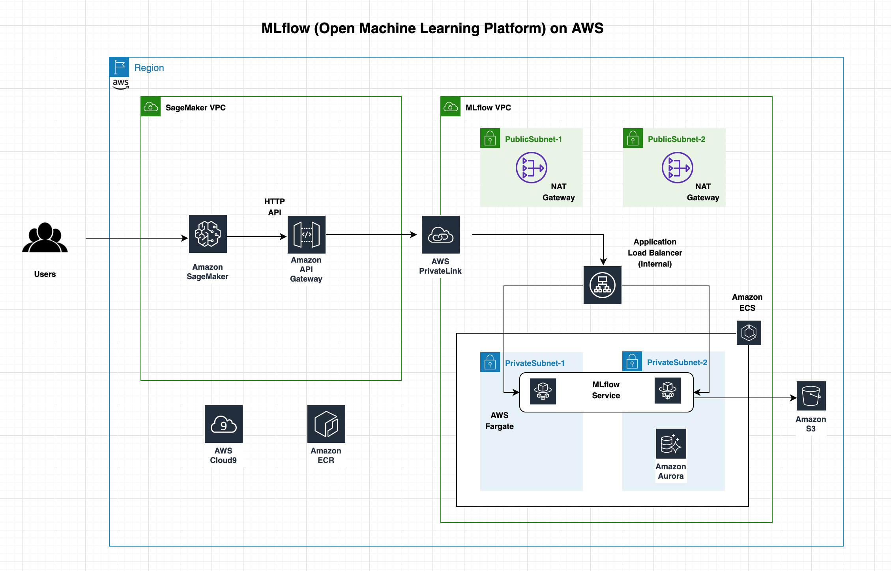
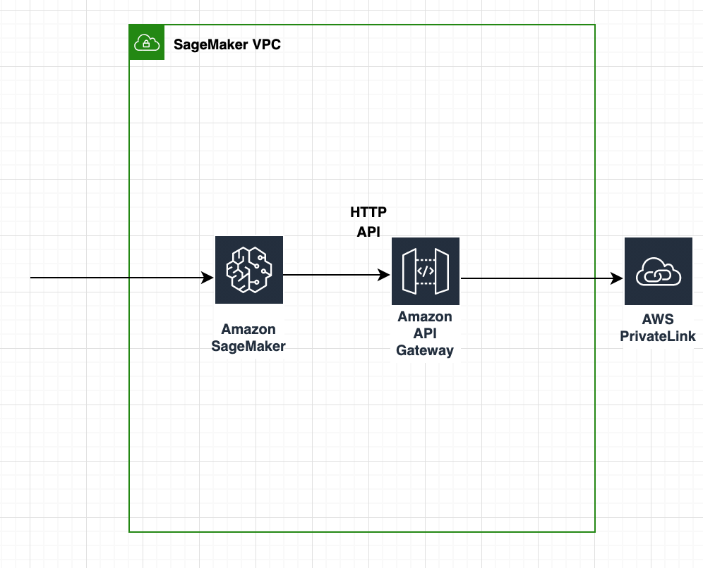

# MLflow (Open Machine Learning Platform) on AWS

[](https://gitpod.io/#https://github.com/aws/aws-cdk)
[](https://badge.fury.io/js/aws-cdk)
[](https://badge.fury.io/py/aws-cdk.core)
[](https://badge.fury.io/nu/Amazon.CDK)

## Introduction

MLflow is an open-source platform to manage the ML lifecycle, including experimentation, reproducibility, deployment, and a central model registry. [MLflow](https://mlflow.org/) is a framework for end-to-end development and tracking of machine learning projects and a natural companion to [Amazon SageMaker](https://aws.amazon.com/sagemaker/), the AWS fully managed service for data science. MLflow solves the problem of tracking experiments evolution and deploying agnostic and fully reproducible ML scoring solutions. It includes the following components.

* Tracking – Record and query experiments: code, data, configuration, and results
* Projects – Package data science code in a format to reproduce runs on any platform
* Models – Deploy ML models in diverse serving environments

## Architecture

In this project, we show how to deploy MLflow on [AWS Fargate](https://aws.amazon.com/fargate) and use it during your ML project with [Amazon SageMaker](https://aws.amazon.com/sagemaker). Our solution is based on three main high level components: 
* The MLFlow server;
* The HTTP API Gateway; and
* The SageMaker Notebook Instance.

### MLflow Server
MLflow is provisioned in a VPC on an Amazon ECS cluster (TODO: add link) using AWS Fargate for the serverless compute engine. The MLflow application is shielded by an internal Application LoadBalancer. We use [Amazon Simple Storage Service](http://aws.amazon.com/s3) (Amazon S3) and [Amazon Relational Database Service](http://aws.amazon.com/rds) (Amazon RDS) as MLflow artifact and backend stores, respectively.

TODO: add the picture for the MLFlow stack VPC, NGINX + mlflow, 

### Amazon API Gateway
In order to implement the private integration, we create a AWS PrivateLink to encapsulate connections between MLflow server and the outside world through an [Amazon HTTP API Gateway](https://docs.aws.amazon.com/apigateway/latest/developerguide/http-api.html). This gives us the possibility to implemt custom access control via several mechanisms, i.e. Lambda Authorizers, JWT Authorizers, and IAM authorization. More info can be found [here](https://docs.aws.amazon.com/apigateway/latest/developerguide/http-api-access-control.html). 

### SageMaker Notebook

[Amazon SageMaker Notebook Instances](https://docs.aws.amazon.com/sagemaker/latest/dg/nbi.html) are a ML compute instances that run the Jupyter Notebook App. SageMaker manages creating the instance and related resources. We will use an Amazon SageMaker Notebook Instance to experiment and tackle our machine learning problem, and to show how SageMaker can be integrated with MLFlow.

## Implementation

Prior to the availability of AWS PrivateLink, services residing in a single Amazon VPC were connected to multiple Amazon VPCs either (1) through public IP addresses using each VPC’s internet gateway or (2) by private IP addresses using VPC peering.

With AWS PrivateLink, service connectivity over Transmission Control Protocol (TCP) can be established from the service provider’s VPC (Producer) to the service consumer’s VPC (Consumer) in a secure and scalable manner. Tom Adamski has provided an [architecture](https://aws.amazon.com/blogs/networking-and-content-delivery/how-to-securely-publish-internet-applications-at-scale-using-application-load-balancer-and-aws-privatelink/) where he shows one way of using AWS PrivateLink along with ALB and NLBs to publish Internet applications at scale. Mani Chandrasekaran provided a [solution](https://aws.amazon.com/blogs/compute/access-private-applications-on-aws-fargate-using-amazon-api-gateway-privatelink/) where he uses API Gateway to expose applications running on AWS Fargate using REST APIs, but it uses NLB since ALB is not yet supported by this architecture.

Our solution leverages the existing applications/ APIs running in AWS Fargate behind a Private ALB inside a VPC and proposes an architecture to expose these APIs securely through HTTP APIs using Amazon API Gateway and AWS PrivateLink.

The target audience for this workshop are developers and architects who want to architect API based services using the existing applications running inside Amazon VPCs.

## Prerequisites
In order to implement the instructions laid out in this post, you will need the following:
- An [AWS account](https://aws.amazon.com/premiumsupport/knowledge-center/create-and-activate-aws-account/) (Producer Account)
- A [GitHub](https://help.github.com/en/github/getting-started-with-github/signing-up-for-a-new-github-account) account

## Architecture
As shown in Fig 1, we shall create one AWS CDK application consisting of three AWS CDK stacks **MLflowVpclinkStack**, **HttpApiGatewayStack**, and a **SageMakerNotebookInstanceStack**.

Inside the MLflowVpclinkStack, we deploy mlflowService using Amazon Fargate within the MLOps VPC. An internal load balancer distributes external incoming application traffic to the mlflowService. In order to implement the private integration we create a VpcLink to encapsulate connections between API Gateway and mlflowService. Inside the SageMakerVpcStack, we create an Http Api that integrates with the mlflowService Amazon Fargate service running inside the MLflowVpclinkStack using the Vpclink and internal load balancer listener.


*Fig 1 - Architecture*

Here are the steps we’ll be following to implement the above architecture:

- Create and configure AWS Cloud9 environment
- Provisioning AWS resources using the AWS CDK
- Testing the Http Api
- Cleanup
- Conclusion


## Create and configure AWS Cloud9 environment
Log into the AWS Management Console and search for Cloud9 service in the search bar.

Click Cloud9 and create an AWS Cloud9 environment in the us-west-2 region based on Amazon Linux 2. Create an IAM role for Cloud9 workspace as explained [here](https://www.eksworkshop.com/020_prerequisites/iamrole/). Attache the IAM role to your workspace as explained [here](https://www.eksworkshop.com/020_prerequisites/ec2instance/). Turn off the AWS managed temporary credentials of the Cloud9 environment as explained [here](https://www.eksworkshop.com/020_prerequisites/workspaceiam/). 

## Provisioning AWS resources using the AWS CDK

### Clone the GitHub repository

Open a new terminal inside AWS Cloud9 IDE and run:
```bash
git clone https://github.com/aws-samples/aws-mlflow-sagemaker-cdk
```

### Install AWS CDK

The AWS Cloud Development Kit (AWS CDK) is an open-source software development framework to model and provision your cloud application resources using familiar programming languages. If you would like to familiarize yourself the CDKWorkshop is a great place to start.

Using Cloud9 environment, open a new Terminal and use the following commands:
```bash
cd aws-mlflow-sagemaker-cdk/cdk/nginxAuthentication
npm install -g aws-cdk@1.124.0
cdk --version
```

Take a note of the latest version that you install, at the time of writing this post it is 1.124.0. Open the package.json file and replace the version “1.124.0” of the following modules with the latest version that you have installed above.

```typescript
    "@aws-cdk/assert": "1.124.0",
    "@aws-cdk/aws-apigatewayv2": "^1.124.0",
    "@aws-cdk/aws-ec2": "1.124.0",
    "@aws-cdk/aws-ecr": "1.124.0",
    "@aws-cdk/aws-ecs": "1.124.0",
    "@aws-cdk/aws-elasticloadbalancingv2": "1.124.0",
    "@aws-cdk/aws-iam": "1.124.0",
    "@aws-cdk/aws-logs": "1.124.0",
    "@aws-cdk/aws-servicediscovery": "1.124.0",
```
```bash
npm install
```
This will install all the latest CDK modules under the node_modules directory.

### Creating AWS resources using the CDK

We shall implement this architecture using an AWS CDK application comprising of two individual CDK stacks:

- **MLflowVpclinkStack** -- contains the Fargate and Vpclink resources.
- **SageMakerVpcStack** -- contains the Http Api integrated with Fargate service using Vpclink.

Let us discuss these stacks one by one.

### **MLflowVpclinkStack**


Under the cdk/nginxAuthentication/lib folder, open the mlflow-vpclink-stack.ts file and let us explore the following different CDK constructs.

Export Vpclink and ALB Listener:
```typescript
 public readonly httpVpcLink: cdk.CfnResource;
 public readonly httpApiListener: elbv2.ApplicationListener;
 ```

These two variables enable us to export the provisioned Vpclink along with the ALB Listener from **MLflowVpclinkStack** stack so as to use these to create the Http Api in the **SageMakerVpcStack** stack.

**VPC:**

This single line of code creates a MLOpsVPC with two Public and two Private Subnets.
```typescript
const vpc = new ec2.Vpc(this, "MLOpsVPC");
```

**Aurora RDS Cluster:**

This creates an Aurora RDS cluster inside the MLOpsVPC, this database is used by MLflow to store metadata about the ML model experiments.

```typescript
const dbConfig = {
  dbClusterIdentifier: `${serviceName}-cluster`,
  engineMode: 'serverless',
  engine: 'aurora-mysql',
  engineVersion: '5.7.12',
  databaseName: dbName,
  masterUsername: databaseCredentialsSecret.secretValueFromJson('username').toString(),
  masterUserPassword: databaseCredentialsSecret.secretValueFromJson('password').toString(),
  dbSubnetGroupName: dbSubnetGroup.dbSubnetGroupName,
  scalingConfiguration: {
    autoPause: true,
    maxCapacity: 2,
    minCapacity: 2,
    secondsUntilAutoPause: 3600,
  },
  vpcSecurityGroupIds: [
    dbClusterSecurityGroup.securityGroupId
  ]
};

// 👇 RDS Cluster 
const rdsCluster = new CfnDBCluster(this, 'DBCluster', dbConfig);
rdsCluster.addDependsOn(dbSubnetGroup)
```
**ECS Cluster:**

This creates an Amazon ECS cluster inside the MLOpsVPC, we shall be running mlflow service inside this ECS cluster using AWS Fargate.

```typescript
    const cluster = new ecs.Cluster(this, "Fargate Cluster" , {
      vpc : vpc,
});
```

**Cloud Map Namespace:**

AWS Cloud Map allows us to register any application resources, such as microservices, and other cloud resources, with custom names. Using AWS Cloud Map, we can define custom names for our application microservice, and it maintains the updated location of the dynamically changing microservice.

```typescript
const dnsNamespace = new servicediscovery.PrivateDnsNamespace(this,"DnsNamespace",{
    name: "http-api.local",
    vpc: vpc,
    description: "Private DnsNamespace for Microservices",
  }
);
```
**ECS Task Role:**

We define in an IAM Role the set of permissions that our AWS Faregat Task is allowed to be granted.

```typescript
    const taskrole = new iam.Role(this, "ecsTaskExecutionRole", {
      assumedBy: new iam.ServicePrincipal("ecs-tasks.amazonaws.com"),
      managedPolicies: [
        iam.ManagedPolicy.fromAwsManagedPolicyName("service-role/AmazonECSTaskExecutionRolePolicy"),
        iam.ManagedPolicy.fromAwsManagedPolicyName("AmazonS3FullAccess")
      ],
      inlinePolicies: {
        secretsManagerRestricted: new iam.PolicyDocument({
          statements: [
            new iam.PolicyStatement({
              effect: iam.Effect.ALLOW,
              resources: [
                mlflowCredentialsSecret.secretArn,
                databaseCredentialsSecret.secretArn
              ],
              actions: [
                "secretsmanager:GetResourcePolicy",
                "secretsmanager:GetSecretValue",
                "secretsmanager:DescribeSecret",
                "secretsmanager:ListSecretVersionIds"
              ]
            }),
            new iam.PolicyStatement({
              effect: iam.Effect.ALLOW,
              resources: ["*"],
              actions: ["secretsmanager:ListSecrets"]
            })
          ]
        })
      }
    });
```

**Task Definition:**

A task definition is required to run Docker containers in Amazon ECS, we shall create the task definition (mlflowTaskDefinition) for the mlflow service.
```typescript
    const mlflowTaskDefinition = new ecs.FargateTaskDefinition(
      this,
      "mlflowTaskDef",
      {
        taskRole: taskrole,
        family: "mlFlowStack"
      },
    );
```
**Log Groups:**

Let us create a log group mlflowServiceLogGroup and the associated log driver.

```typescript
    const mlflowServiceLogGroup = new logs.LogGroup(this, "mlflowServiceLogGroup", {
      logGroupName: "/ecs/mlflowService",
      removalPolicy: cdk.RemovalPolicy.DESTROY,
    });

    const mlflowServiceLogDriver = new ecs.AwsLogDriver({
      logGroup: mlflowServiceLogGroup,
      streamPrefix: "mlflowService",
    });
```
**ECR Repository:**

Amazon Elastic Container Registry (ECR) is a fully managed container registry that makes it easy to store, manage, share, and deploy container images containing the business logic of the microservices. Let us import the repository mlflowservicerepo.
```typescript
    // Amazon ECR Repository
    const mlflowservicerepo = ecr.Repository.fromRepositoryName(
      this,
      "mlflowServiceRepo",
      "mlflow-Service"
    );
```  
**Task Containers:**

Let us define two containers in the `mlflowTaskDefinition` task definition, i.e. the NGINX container acting as reverse proxy, and the MLFlow container where the MLFlow server code is running.
It is important to note how we securely pass credentials (generated and stored securely in AWS Secrets Manager) to the task definition.
The ECS Task Role described earlier defines, among the others, the custom policy that grants to the Fargate task read-access to exclusively the two secrets needed by the containers.
In this way, all credentials are transparently handled by Fargate, avoiding to expose any sensitive information to the task definition in clear text.

For the interested reader on the topic on how to secure credentials with Fargate and AWS Secrets Manager, [this blogpost](https://aws.amazon.com/blogs/compute/securing-credentials-using-aws-secrets-manager-with-aws-fargate/) provide a more in depth discussion.

```typescript
    const nginxContainer = mlflowTaskDefinition.addContainer(
      "nginxContainer",
      {
        containerName: "nginxContainer",
        essential: true,
        // memoryReservationMiB: 512,
        // cpu: 512,
        portMappings: [{
          containerPort: 80,
          protocol: ecs.Protocol.TCP
        }],
        image: ecs.ContainerImage.fromAsset('../../src/nginx/basic_auth', {
          repositoryName: containerRepository
        }),
        secrets: {
          MLFLOW_USERNAME: ecs.Secret.fromSecretsManager(mlflowCredentialsSecret, 'username'),
          MLFLOW_PASSWORD: ecs.Secret.fromSecretsManager(mlflowCredentialsSecret, 'password')
        },
        logging: mlflowServiceLogDriver,
      }
    );

    const mlflowServiceContainer = mlflowTaskDefinition.addContainer(
      "mlflowContainer",
      {
        containerName: "mlflowContainer",
        essential: true,
        // memoryReservationMiB: 512,
        // cpu: 512,
        portMappings: [{
          containerPort: containerPort,
          protocol: ecs.Protocol.TCP,
        }],
        image: ecs.ContainerImage.fromAsset('../../src/mlops', {
          repositoryName: containerRepository,
        }),

        environment: {
          'BUCKET': `s3://${mlOpsBucket.bucketName}`,
          'HOST': rdsCluster.attrEndpointAddress,
          'PORT': `${dbPort}`,
          'DATABASE': dbName
        },
        secrets: {
          USERNAME: ecs.Secret.fromSecretsManager(databaseCredentialsSecret, 'username'),
          PASSWORD: ecs.Secret.fromSecretsManager(databaseCredentialsSecret, 'password')
        },
        logging: mlflowServiceLogDriver,
      });
```

***NGINX container:***

The NGINX container acts as reverse proxy in front of the MLFlow container, providing also a simple and straighforward way to add Basic Auth to the MLFlow server.

In order to securely inject the credentials auto-generated in AWS Secrets Manager into the container, the credential file for NGINX at container startup.
The creation of the credential file for NGINX is handled by a script whose content is provided below:

```bash
#!/bin/sh
echo -n $MLFLOW_USERNAME: >> /etc/nginx/.htpasswd
openssl passwd -1 $MLFLOW_PASSWORD >> /etc/nginx/.htpasswd
```

In the `Dockerfile`, since we are using the `CMD` command to run the script at startup time, we must include `-g 'daemon off';` in order to allow nginx to stay in the foreground.
As such, Docker can track the process properly (otherwise your container will stop immediately after starting).
Generating the credential file at container startup rather then during the build process adds little overhead, however this is for the greater good, since we have now the security and the flexibility to change credentials too without the need to rebuild the container.

```dockerfile
FROM nginx:1.17.6
RUN apt-get update
RUN apt-get install openssl -y
# Remove default Nginx config
RUN rm /etc/nginx/nginx.conf
# Copy the modified Nginx conf
COPY nginx.conf /etc/nginx/nginx.conf
RUN ln -sf /dev/stdout /var/log/nginx/access.log \
    && ln -sf /dev/stderr /var/log/nginx/error.log

COPY script.sh /root/script.sh
RUN chmod +x /root/script.sh

CMD /root/script.sh && nginx -g 'daemon off;'
```

Finally, let us highlight at an important setting in the `nginx.conf` file, i.e., `resolver 169.254.169.253;`, needed to allow the DNS resolution within the AWS VPC, so that the NGINX container can resolve the MLFlow container IP address via DNS.

```
location / {
  proxy_set_header X-Forwarded-For $proxy_add_x_forwarded_for;
  proxy_set_header Host $http_host;
  proxy_redirect off;
  resolver 169.254.169.253;
  set $mlflow mlflowservice.http-api.local;
  proxy_pass http://$mlflow:5000;
  auth_basic           "Administrator’s Area";
  auth_basic_user_file /etc/nginx/.htpasswd; 
}

```
***MLFlow container:***

The MLFlow container pip-install the MLFlow server. Then the MLFlow server is started at container startup.
Similarly as we did for the NGINX credentials, we ensure that the credentials for the Aurora Database are injected at startup time by Fargate from the AWS Secrets Manager.

```dockerfile
FROM python:3.8.0

RUN pip install \
    mlflow==1.18.0 \
    pymysql==1.0.2 \
    boto3 && \
    mkdir /mlflow/

EXPOSE 5000

CMD mlflow server \
    --host 0.0.0.0 \
    --port 5000 \
    --default-artifact-root ${BUCKET} \
    --backend-store-uri mysql+pymysql://${USERNAME}:${PASSWORD}@${HOST}:${PORT}/${DATABASE}

```

**Security Groups:**

In order to control the inbound and outbound traffic to Fargate tasks, we shall create a security group that act as a virtual firewall.    
```typescript
    const mlflowServiceSecGrp = new ec2.SecurityGroup(
      this,
      "mlflowServiceSecurityGroup",
      {
        allowAllOutbound: true,
        securityGroupName: "mlflowServiceSecurityGroup",
        vpc: vpc,
      }
    );
    mlflowServiceSecGrp.connections.allowFromAnyIpv4(ec2.Port.tcp(containerPort));
    mlflowServiceSecGrp.connections.allowFromAnyIpv4(ec2.Port.tcp(80));
```

**Fargate Service:**

Let us create an ECS Fargate service (mlflowService) based on the task definition created above.
An Amazon ECS service enables you to run and maintain a specified number of instances of a task definition simultaneously in an Amazon ECS cluster. If any of your tasks should fail or stop for any reason, the Amazon ECS service scheduler launches another instance of your task definition to replace it in order to maintain the desired number of tasks in the service. 

```typescript
    const mlflowService = new ecs.FargateService(this, "mlflowService", {
      cluster: cluster,
      serviceName: serviceName,
      taskDefinition: mlflowTaskDefinition,
      assignPublicIp: false,
      desiredCount: 2,
      securityGroup: mlflowServiceSecGrp,
      cloudMapOptions: {
        name: "mlflowService",
        cloudMapNamespace: dnsNamespace,
      },
    });
```

**ALB:**

The load balancer distributes incoming application traffic across ECS services, in multiple Availability Zones. This increases the availability of your application. Let us add an internal Application Load Balancer.

```typescript
    const httpApiInternalALB = new elbv2.ApplicationLoadBalancer(
      this,
      "httpapiInternalALB",
      {
        vpc: vpc,
        internetFacing: false,
      }
    );
 ```   
**ALB Listener:**

An ALB listener checks for connection requests from clients, using the protocol and port that we configure.

```typescript
    this.httpApiListener = httpApiInternalALB.addListener("httpapiListener", {
      port: 80,
      protocol: ApplicationProtocol.HTTP,

    });
```
**Target Groups:**

We shall create a target group, mlflowServiceTargetGroup pointing to the NGINX container. 

```typescript
    const mlflowServiceTargetGroup = this.httpApiListener.addTargets(
      "mlflowServiceTargetGroup",
      {
        healthCheck: {
          path: "/elb-status"
        },
        targets: [
          mlflowService.loadBalancerTarget(
            {
              containerName: 'nginxContainer',
              containerPort: 80
            }
          )
        ],
        port: 80,
        protocol: ApplicationProtocol.HTTP,
      }
    );
```
**Auto Scaling Group:**

We shall create an auto scaling group autoScaling for mlflowService microservice.

👇 Task Auto Scaling
```typescript
    const autoScaling = mlflowService.autoScaleTaskCount({ maxCapacity: 6 });
    autoScaling.scaleOnCpuUtilization('CpuScaling', {
      targetUtilizationPercent: 70,
      scaleInCooldown: cdk.Duration.seconds(60),
      scaleOutCooldown: cdk.Duration.seconds(60),
    });
```


***VPC Link:***

It is easy to expose our HTTP/HTTPS resources behind an Amazon VPC for access by clients outside of the Producer VPC using API Gateway private integration. To extend access to our private VPC resources beyond the VPC boundaries, we can create an HTTP API with private integration for open access or controlled access. The private integration uses an API Gateway resource of VpcLink to encapsulate connections between API Gateway and targeted VPC resources. As an owner of a VPC resource, we are responsible for creating an Application Load Balancer in our Producer VPC and adding a VPC resource as a target of an Application Load Balancer's listener. As an HTTP API developer, to set up an HTTP API with the private integration, we are responsible for creating a VpcLink targeting the specified Application Load Balancer and then treating the VpcLink as an effective integration endpoint. Let us create a Vpclink based on the private subnets of the MLOpsVPC.

```typescript
    this.httpVpcLink = new cdk.CfnResource(this, "HttpVpcLink", {
      type: "AWS::ApiGatewayV2::VpcLink",
      properties: {
        Name: "http-api-vpclink",
        SubnetIds: vpc.privateSubnets.map((m) => m.subnetId),
      },
    });
```

## Create an HTTP Api based on the mlflowService Fargate Service

**HttpApiStack**


Under the cdk/nginxAuthentication/lib folder, open the http-gateway-stack.ts file and let us explore the following different CDK constructs.

**HTTP Api:**

Let us create an Http Api based on a default stage.

👇 HTTP Api
```typescript
    const api = new apig.HttpApi(this, "mlflow-api", {
      createDefaultStage: true,
    });
```

**API Integration:**

The following construct will integrate the Http Api with the backend mlflowService using the Vpclink and the Application Loadbalancer Listener.

👇 HTTP Api Integration
```typescript
    const integration = new apig.CfnIntegration(
      this,
      "MLflowIntegration",
      {
        apiId: api.httpApiId,
        connectionId: httpVpcLink.ref,
        connectionType: "VPC_LINK",
        description: "API Integration",
        integrationMethod: "ANY",
        integrationType: "HTTP_PROXY",
        integrationUri: httpApiListener.listenerArn,
        payloadFormatVersion: "1.0",
      }
    );
```
**API Route:**

Now let us create the Http Api proxy routes using the Api integration.


👇 HTTP Api Route
```typescript
    new apig.CfnRoute(this, "Route", {
      apiId: api.httpApiId,
      routeKey: "ANY /{proxy+}",
      target: `integrations/${integration.ref}`,
    });
```
## Create a SageMaker Notebook Instance with lifecycle configurations

**Lifecycle configuration**

**SageMaker execution role**

**SageMaker Notebook Instance**

## Setting the region (optional)
The default region is `us-west-2`. You can change the default region by setting up the `AWS_REGION` environment variable.

### Working with Cloud9
If you are working on Cloud9, you can specify the same region where your Cloud9 environment is running as follow:
```
sudo yum install jq
export AWS_REGION=$(curl -s 169.254.169.254/latest/dynamic/instance-identity/document | jq -r '.region')
echo "export AWS_REGION=${AWS_REGION}" | tee -a ~/.bash_profile
```

Before deploying, and since we building the mlflow container image locally, the Cloud9 default disk space, i.e. 20GB, is not enough.
To resize on the fly without rebooting the instance, you can run the following script specifying a new desired size.
```
./resize-cloud9.sh 40
```
Where `40` represents the new desired disk size in GB.

## Provisioning AWS resources using the AWS CDK

```bash
cd ~/environment/aws-mlflow-sagemaker-cdk/cdk/nginxAuthentication
npm run build
cdk bootstrap
```

Finally, we are ready to deploy our stack.
```
./deploy.sh
```

## Testing the Http Api 

TBD

## Cleanup

To clean up the resources created by the CDK, run the following commands in a terminal of your Cloud9 instance:

```bash
cd ~/environment/aws-mlflow-sagemaker-cdk/cdk/nginxAuthentication
./destroy.sh
```

At the prompt, enter y.

## Conclusion

The benefit of this serverless architecture is that it takes away the overhead of having to manage underlying servers and helps reduce costs, as you only pay for the time in which your code executes.

